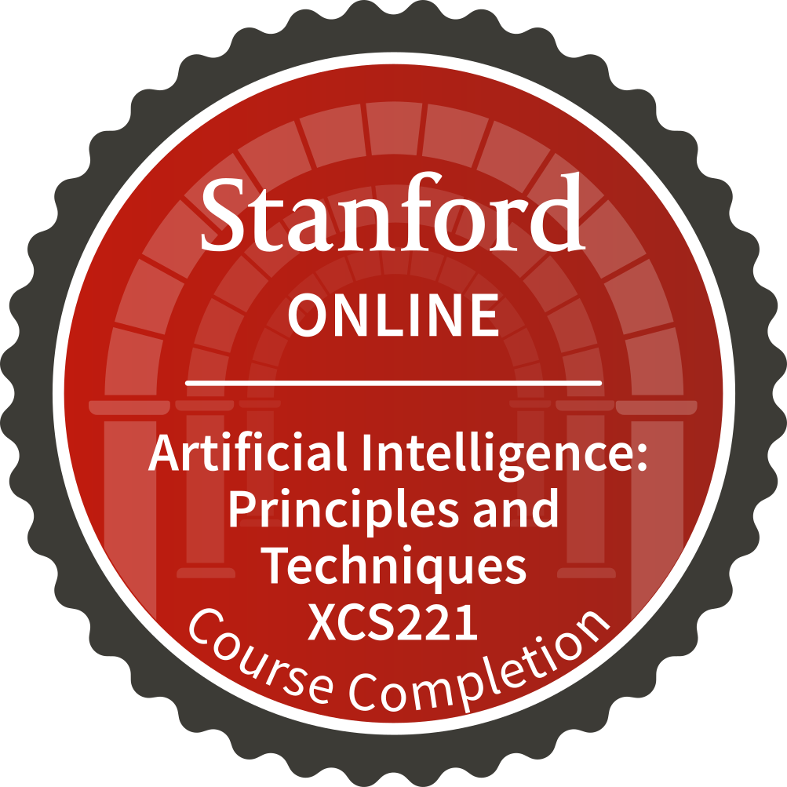
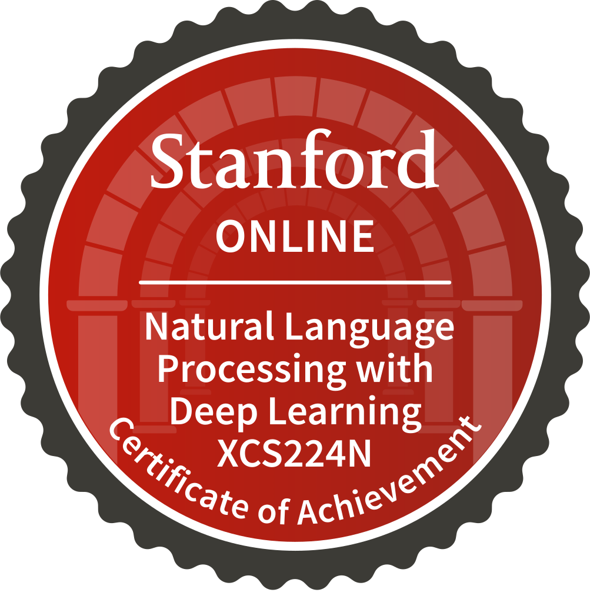

### Hi there 👋

- I am currently dedicated full time to the [Artificial Intelligence Professional Program](https://www.youtube.com/watch?v=5SVXUAFvui4) at Stanford University (OnLine).
- I have worked in big companies like [VMware](https://github.com/vmware), [Workday](https://github.com/workday) and [IBM](https://github.com/workday). But, also navigated different challenges when working at startups like [Consensys](https://github.com/consensys).
- My background is diverse but my focus at the moment is on Large Language Models, Fine-tuning, Retrieval Augmented Generation (RAG) and agentic design patterns.

### Certificates

